# Trends in Supplemental Education Program
Author: Elijah Lopez

## Overview
This analysis outlines actionable strategies to improve lead conversion, customer retention, and program effectiveness for a supplemental education program. To optimize lead conversion, this business should re-engage open leads and inactive accounts, highlight long-term value, and prioritize enrollment efforts during high-interest periods like October. Tailored marketing strategies targeting parents of late-elementary school students in key zip codes combined with seasonal promotions during the summer can further enhance lead generation. Referral programs and upselling private sessions to high schoolers present additional opportunities to boost revenue and engagement.

Retention and program effectiveness can be strengthened through active communication with families, clear progress tracking, and incentives for long-term commitments. Monitoring student performance at critical milestones ensures mastery and alignment with family goals, while time-based metrics provide clarity on program expectations and outcomes. By aligning these efforts, this business can foster trust, improve operational efficiency, and deliver meaningful results for both students and families.

## Business Problem
This supplemental education program seeks to improve its ability to convert prospective leads into active enrollments, retain students for longer periods, and deliver measurable outcomes that align with family expectations. Addressing these challenges requires identifying patterns in lead behavior, tailoring marketing efforts to key demographics, and ensuring that program offerings effectively meet the diverse needs of students.

## Data
The data used in this project was proprietary and analyzed with explicit permission from the business owner. It was sourced from multiple internal systems and consolidated into three primary datasets to facilitate comprehensive analysis:
* Leads - There are 1,533 leads from Aug 2011 - Dec. 2024 measured on 7 features. These include information such as when the lead was created, lead source, student information, and whether or not they enrolled.
* Accounts - There are 653 accounts from June 2013 - Dec. 2024 measured on 10 features. These include contract start and end dates as well as enrollment length and type, current status, and student information.
* Student Progress per Assessment Level - Assessment data combines all assessments for each grade level a student worked on where the student had attempted at least one post-assessment. There are 356 assessments matching this criteria from 2000-01-01 to 2024-12-09. Each assessment is measured across 12 features such as pre- and post-assessment dates, level, student grade, number of attempts, and per level metrics such as PKs (assignments) and number visits to the center.

## Methods

In order to maintain confidentiality and protect proprietary details I merged source documents (7 in total) based on Lead ID. 

### Leads
* Merged two sources, each with unique information
* Encrypted zip codes
* Condensed lead sources based on key phrases
* Dropped 'bad leads' (no contact information; 2)

### Accounts
* Merged two sources, each with unique information
* Dropped sensitive customer information but otherwise used raw data.
* No null values

### Student Progress per Assessment Level
* Single source document
* Created map for assessment names to grade level equivalent
    * Used this to calculate relative student performance to grade level
* For nulls in grade_on_post_dt. (15) I imputed median grade for the matching assessment level.
* Dropped 'NF' assessment types due to differences in implementation from traditional assessments (18 entries).

### Other
* Converted dates to date time and calculated elapsed time from creation to today
    * Assigned 3 letter abbreviation in 'month' column which was then grouped and plotted for various visualizations
* Created grade map to convert grade from string to integer
    * Used this to calculate grade a time of lead creation and grade at time of enrollment
* Standardized enrollment data to float format

## Results
### Leads
#### Lead Volume
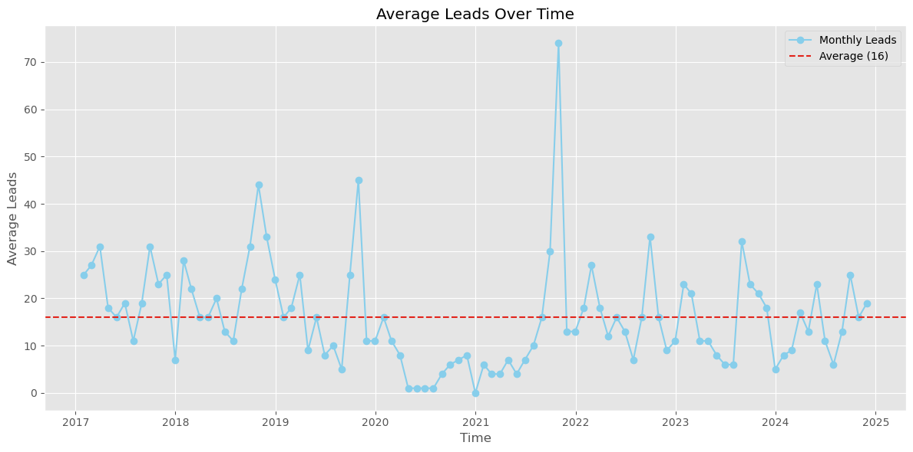
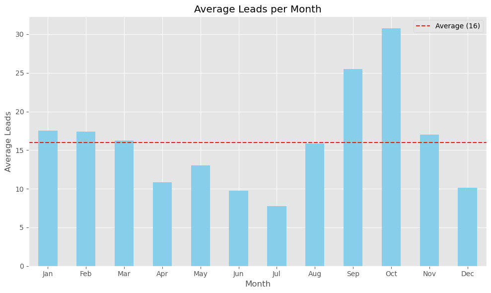
* Cyclical pattern, except during COVID where it remained at depressed levels.
* New monthly leads average 16.
* New leads are highest in Sept. & Oct. (middle to end of the first quarter).
* New leads are lowest during June & July (summer).

#### Leads Converted
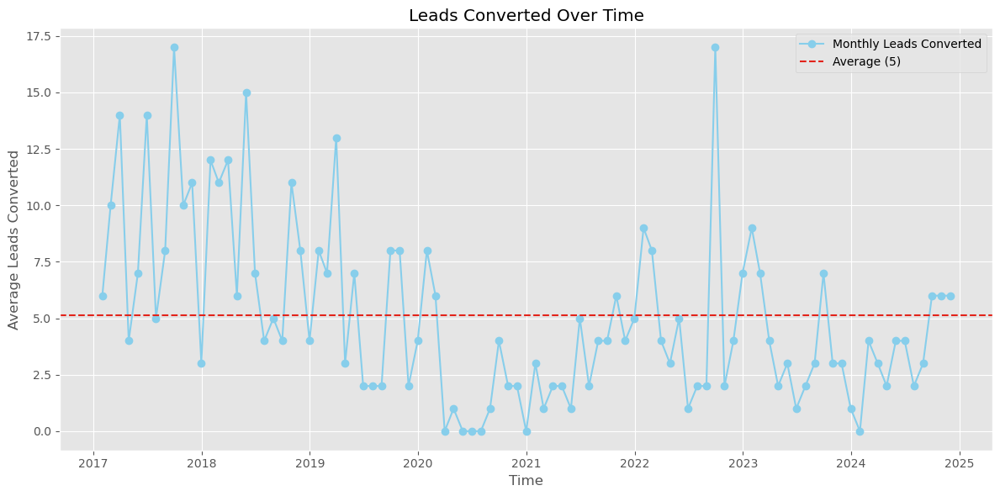
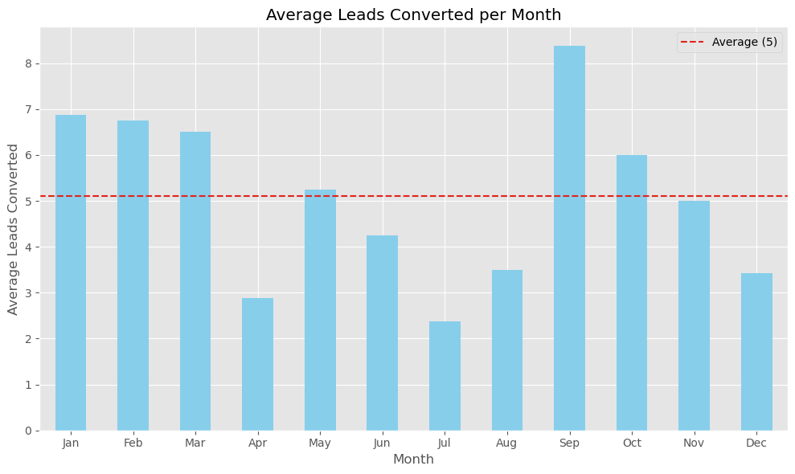
* Cyclical pattern but with post-COVID years averaging lower than pre-COVID years.
* Average monthly leads converted is 5.
* Lead conversion is highest in Sept, and the first three months of the calendar year.
* Lead conversion is lowest in Apr. & July (end of school year & summer respectively).

#### Percent Lead Conversion
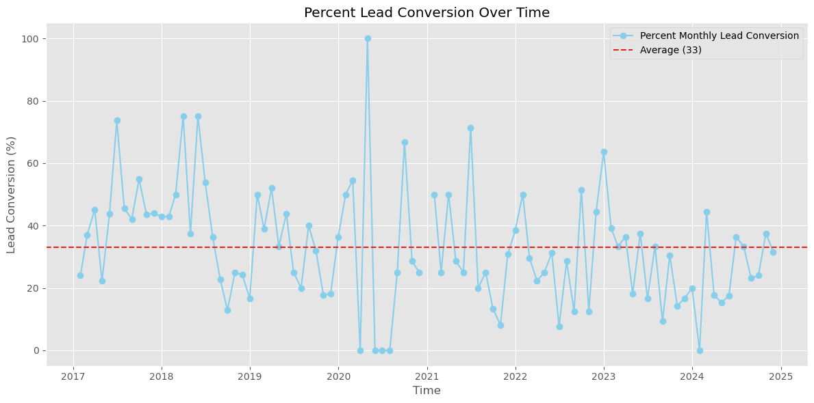
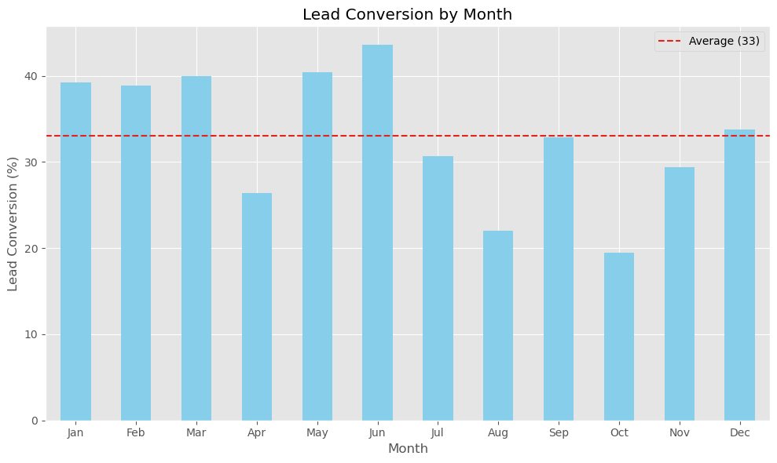
* Cyclical pattern with poorest performance starting in 2023.
* Average monthly conversion is 33%.
* Highest conversion rate is in May & June (families more serious about getting summer help).
* Lowest conversion is in Aug. & Oct. (opportunity zone!)

#### Other
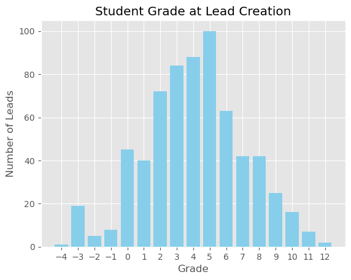

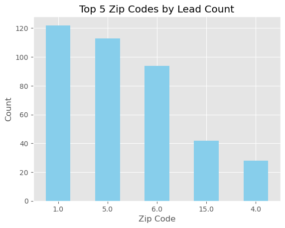
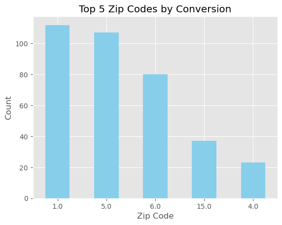
* Leads are most common for elementary-aged students, specifically grades 2-5.
* Leads who enroll in the program are most commonly from zip codes 1, 5, and 6.

### Accounts
#### Enrollments Over Time
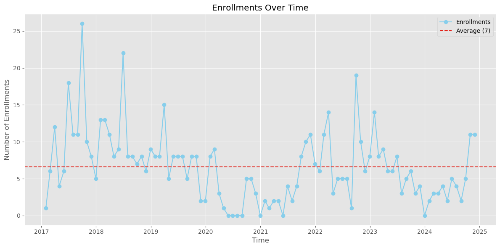
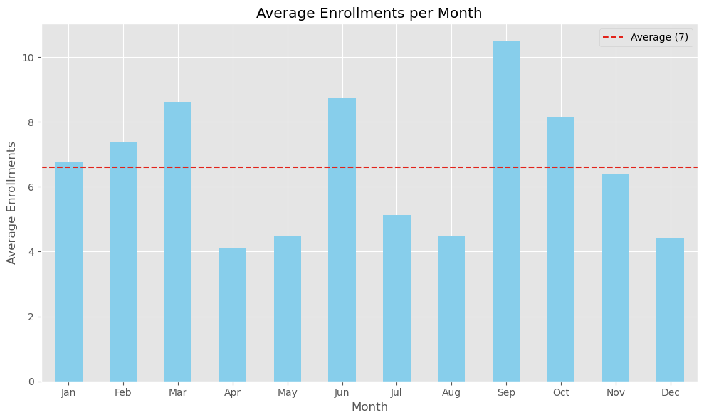
* Average monthly enrollment is 7, indicating mild success with re-enrollments of same students and/or sibling enrollments.

#### Program Types and Student Grade Levels
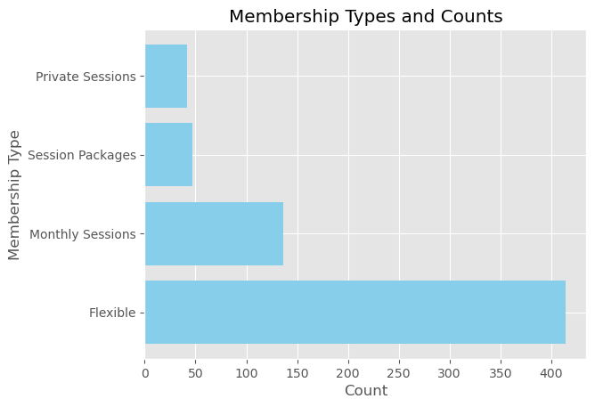
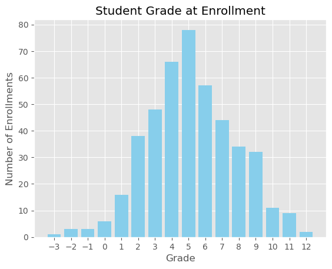
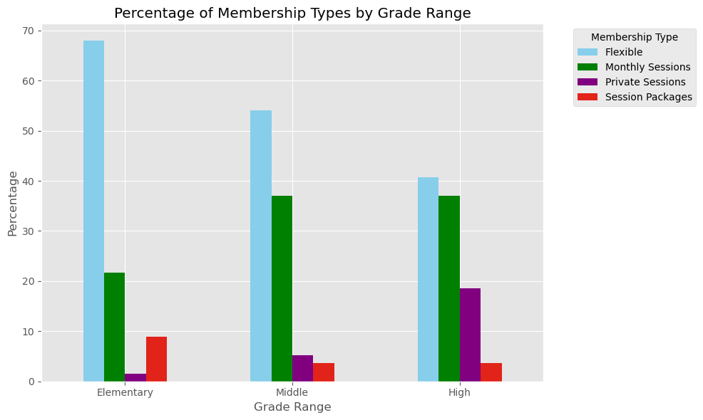
* The dominant enrollment type is the Flexible option. Broken down by grade range we see:
    * Elementary: 68% enrolled in Flexible option with 22% enrolled in Monthly Sessions.
    * Middle: 54/37 split
    * High: 41/37 with a large increase in demand for private sessions (18)
* Student grade at enrollment shifts slightly upward to grades 4-6.

#### Cancelations
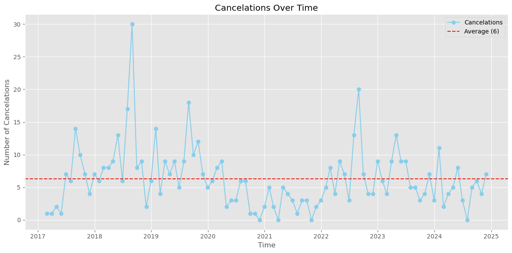
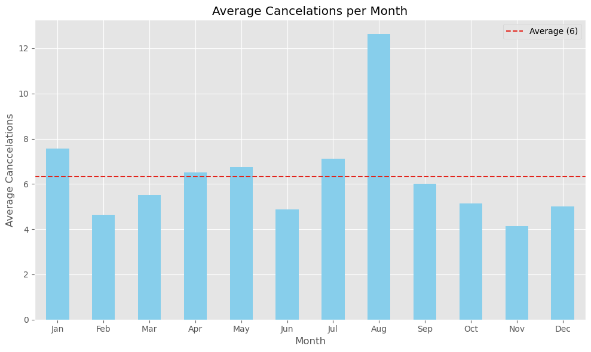
* Average monthly cancelations is 6.
    * Highest month is Aug. Possibly explained by families wanting to "see how this year goes" before committing to longer term option. (opportunity zone!)
    * Lowest month is Nov. (heading toward semester 1 finals).

#### Net Enrollments Over Time
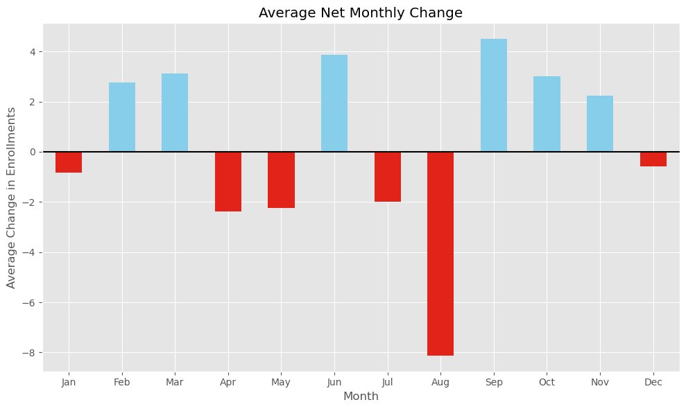
* Net change in enrollments shows similar patterns (positive in Sept., negative in Aug.)
    * Average Net change per year is +3.

#### Enrollment Length
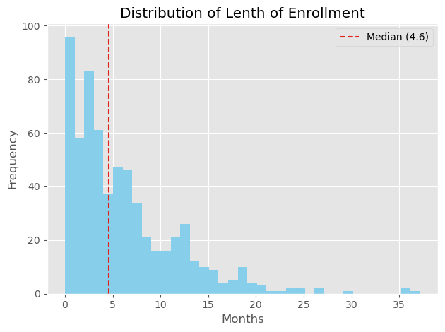
* Enrollment length is 4.6 (median) to 6.2 (mean) months.

### Student Progress per Assessment Level
#### Relative Performance
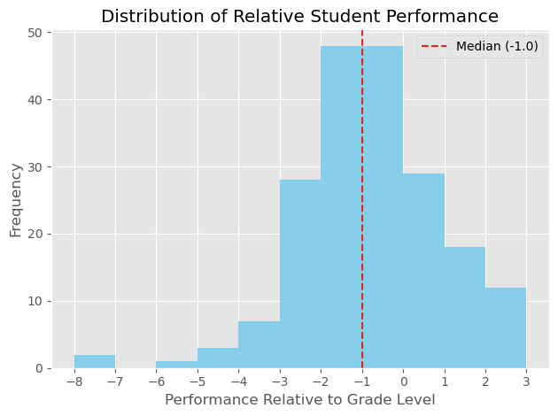
* Relative student performance is 1.5 (mean) to 1.0 (median) BELOW grade level.

#### Assessment Progress per Attempt
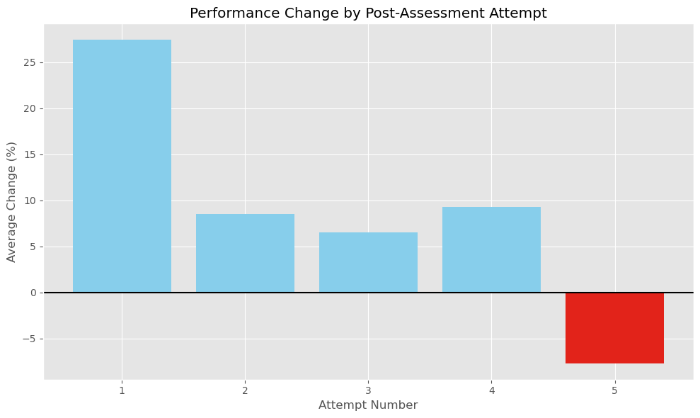
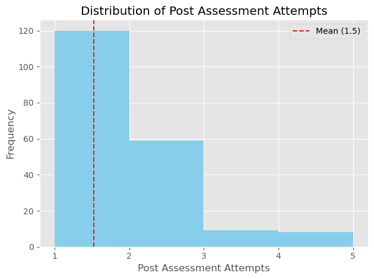
* Students progress most upon first post-assessment attempt at 27%.
    * Subsequent attempts plateau near 7-8% improvement before declining at the 5th attempt.
* Most students pass to the next level within 1-2 attempts.

#### Per Level Metrics
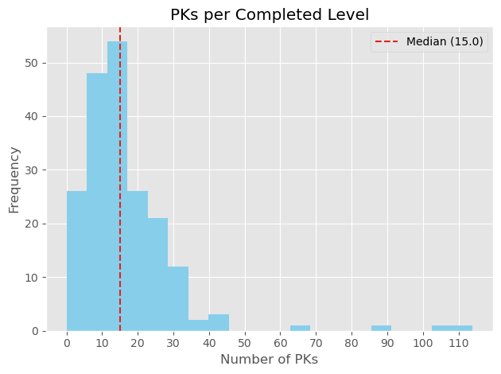
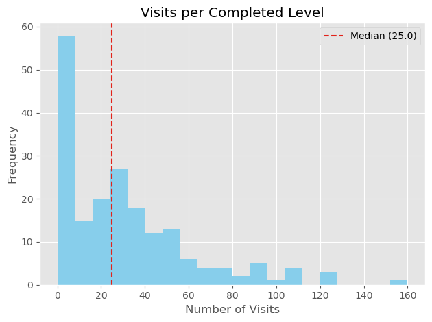
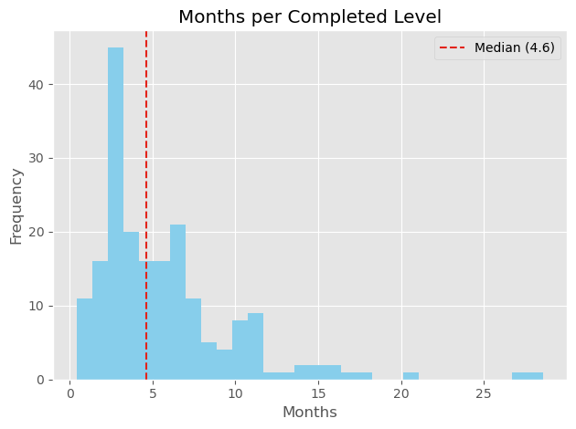
* PKs completed is approximately 15.
* Attendance is 25 sessions.
* Time is 4.6 (median) to 6.0 (mean) months.

## Conclusions
This analysis leads to the following recommendations:
### Leads
* Re-engage with ‘open’ leads to push them further in the pipeline.
* Demonstrate long term value to unconverted leads, incentivizing them to come in for assessments if necessary.
* With lead interest highest  at the end of the first quarter, focus on enrollment conversion during that time.
    * Best opportunity is in October since it consistently has the most leads but also the lowest conversion rate.
* With lead interest lowest over the summer:
    * Focus marketing efforts to capture additional lead interest.
    * Focus on retention strategies for enrolled families.
* Ensure marketing strategy is tailored to target demographic:
    * Parents of late-elementary school students (grades 3-5).
    * Residents in zip codes 1, 5, and 6.

### Accounts
* Re-engage ‘inactive’ accounts for re-enrollment.
* Create a referral program to simultaneously increase revenue and reputation.
* Tailor program offering to grade range.
* Upsell current customers (especially high schoolers) by offering private sessions at key times of the year.
* Increase retention through active communication and progress reporting, especially leading up to August.
* Incentivize longer commitments to increase average length of stay.

### Student Progress per Assessment Level
* Highlight capability to work with students of all ability levels to build trust and credibility with new leads. 
* Flag students that are failing to achieve a passing score after their second post-assessment to understand reasons why.
    * Target higher pre-assessment scores so students are more likely to pass post-assessment within two attempts.
* Monitor PK completion, checking for true mastery along the way.
* Use time-based metrics to set expectations for interested families and to advise best program to match their objectives to their child's current perforamnce level. These should also be used to communicate progress toward long-term objectives over the course of their enrollment.
    * Visits per Level: 25-35
    * Time per Level: 4.6-6.0 months

## Next Steps
* Use long term and monthly understanding of lead volume and lead conversion/enrollment data to:
    * Make informed decisions about promotional offerings:
        * Incentives for new families to get started.
        * Discounts for continuous enrollment beyond average.
    * Provide appropriate staff training at critical times of the year:
        * Sales training leading up to October.
        * Retention training leading toward the summer.
    * Create structured and realistic expectations of management staff performance.
        * Enhance staff motivation by offering bonuses for exceptional conversion rates.
* Use demographic information to:
    * Create unique marketing campaigns based on location.
    * Tailor marketing efforts to parents of late-elementary and early-middle school students.
* Use student assesssment/enrollment information to:
    * Make program recommendations based on student profile.
    * Strategize on approaches to extend student enrollment.
    * Monitor enrolled students' progress and:
        * Intervene when they are not meeting goals.
        * Communicate with parents about current standing and confirm/reset expectations for the future.

## For More Information
See the full analysis in the [Jupyter Notebook](https://github.com/elijahlopez94/trends_in_supplemental_education_program/blob/main/eda_notebook.ipynb) or review this [presentation](URL_for_slides).

For additional info, contact the author at:

Elijah Lopez | elijahlopez94@gmail.com